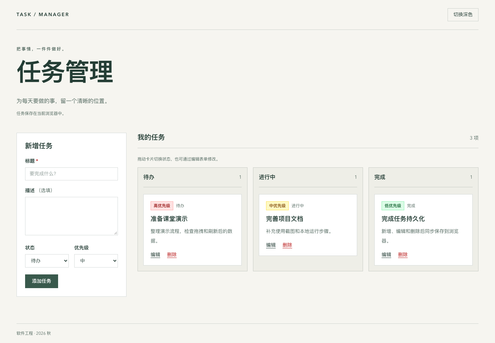
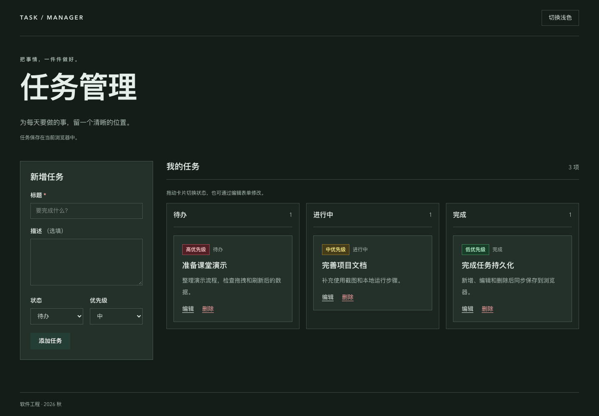
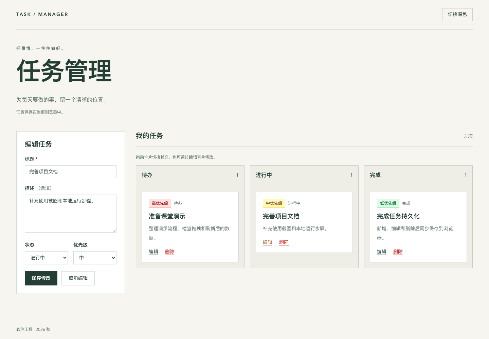

# task-manager
A task manager demo project for Software Engineering, PKU, 2026fall

## 本轮范围

Vue 3 + TypeScript + Vite + Tailwind CSS 任务管理应用，已实现任务新增、
展示、编辑和删除。支持标题校验、三种状态和带颜色标签的三种优先级。
任务成功变更后同步保存到 localStorage，初始化时恢复，刷新后保留。支持三列 Kanban 跨列拖拽及深色模式。
`useTasks()` 提供共享任务状态，拖拽复用 `moveTask()`；`useTheme()` 保存并恢复主题选择。

## 使用截图

浅色看板：任务按待办、进行中、完成分列，优先级以红、黄、绿区分，支持跨列拖拽。



深色模式：通过右上角按钮切换，刷新后保留主题选择。



编辑任务：点击卡片上的“编辑”，在表单中修改标题、描述、状态和优先级，然后保存。



## 本地运行

使用 Node.js 20.19+（20.x）或 22.12+，执行：

```sh
npm ci
npm run dev
```

打开终端显示的本地 URL（默认 http://localhost:5173）。应看到新增表单和任务列表；首次访问无历史任务时列表为空。

浏览器验收：

1. 空标题或全空格标题提交失败，出现中文提示。
2. 仅填标题即可添加；标题首尾空格去除，默认待办、中优先级，描述为空。
3. 添加不同状态和优先级的任务，检查高 / 中 / 低分别显示红 / 黄 / 绿标签，并出现在待办 / 进行中 / 完成对应列。
4. 编辑任务，修改四个业务字段并保存；任务数量不变。取消编辑不影响原内容。
5. 删除时先取消，任务仍在；确认删除后任务消失。删除正在编辑的任务后恢复新增表单。
6. 新增后刷新，任务各字段保持不变；编辑标题、描述、优先级和状态后刷新，修改保留；确认删除后刷新，任务不再出现。
7. 缩小窗口至手机宽度，检查表单和列表按单列展示，无横向溢出。
8. 开发者工具 Application → Local Storage 中检查 `task-manager:tasks:v1`，成功操作立即更新；校验失败、取消编辑或取消删除不改变存储。
9. 关闭页面再打开同一网址，任务仍在。验证期间使用相同协议、域名、端口，`localhost` 与 `127.0.0.1` 不共享存储。
10. 将卡片拖到另一列（包括空列），立即移动且刷新后保持；同列放下、取消拖动不改变状态。本轮不支持列内排序，触屏或键盘用户可通过编辑表单修改状态。
11. 编辑任务标题但暂不保存，将该卡片拖到另一列后保存，标题和新状态均保留。
12. 顶栏切换明暗主题，检查表单、卡片、三列和优先级标签；刷新后保持选择。主题键为 `task-manager:theme:v1`，首次默认浅色。

异常验证（先备份存储内容）：将该键改为非法 JSON 后刷新，页面仍能启动，原始存储不会在初始化时被覆盖。
读取失败或字段校验失败时使用空列表并设置 `storageError`；后续成功的任务操作会保存当前列表，替换原存储。
写入失败保留内存状态并设置 `storageError`，下一次保存成功后清除错误；此时未保存的修改在刷新后可能丢失。
本轮未新增存储错误提示 UI，异常路径由状态层测试覆盖。

```sh
npm test
npm run lint
npm run build
npm run preview
```

浏览器自动化验证：先执行 `npx playwright install chromium`，再执行 `npm run test:e2e`。

build 包含 TypeScript 检查，产物输出到 `dist/`。preview 用于在浏览器检查生产构建，
打开终端显示的 URL（默认 http://localhost:4173）。

## 目录

```text
src/
├── main.ts
├── App.vue
├── vite-env.d.ts
├── assets/main.css
├── components/
│   ├── AppHeader.vue
│   ├── TaskForm.vue
│   ├── TaskCard.vue
│   ├── TaskBoard.vue
│   ├── TaskColumn.vue
│   └── TaskBoard.test.ts
├── types/task.ts
└── composables/
    ├── useTasks.ts   # 共享状态及 localStorage 持久化
    ├── useTasks.test.ts
    ├── useTheme.ts   # 主题与持久化
    └── useTheme.test.ts
```

## 后续实现约定

- Task 字段为 id、title、description、status、priority；id 不可修改。
- title 保存前 trim 且不能为空；description 默认为空字符串，status 默认为 todo，priority 默认为 medium。
- 任务通过共享 composable 修改，组件只读状态；操作失败返回明确结果且不修改任务。
- 存储错误单独通过 storageError 暴露；任务使用 `task-manager:tasks:v1`，主题使用 `task-manager:theme:v1`。
- TaskColumn、TaskBoard 实现跨列拖拽，不含列内排序。
- 主题首次访问默认浅色，存储不可用时仍可在当前页面切换。
